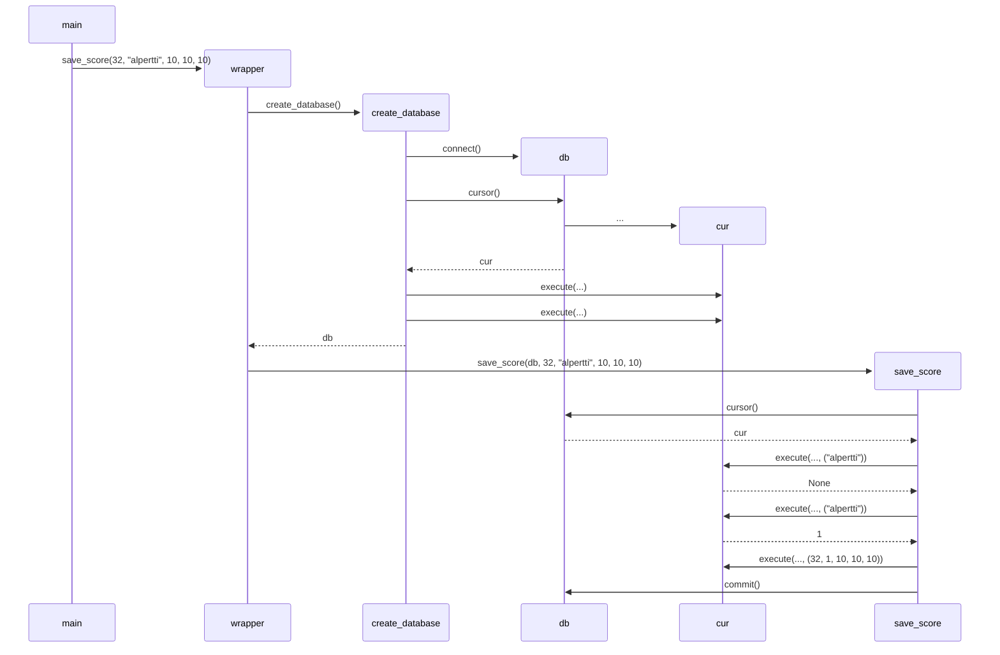

Arkkitehtuurikuvaus
===================

Rakenne
-------

Ohjelman koodi noudattaa eräänlaista kerrosrakennetta ja jakautuu pääasiallisesti
pakkauksiin `ui` ja `game`,
joista ensimmäinen sisältää käyttöliittymäkoodia ja jälkimmäinen sovelluslogiikkaa.
Pakkaus `ui` sisältää moduulit `text_ui` ja `graphical_ui`,
joiden funktioita kutsutaan suoraan `main`-moduulista, josta ohjelman suoritus alkaa.
Sovellusta ajettaessa käytetään käyttöliittymämoduuleista **jompaa kumpaa**.
Pakkauksen `ui` moduulit keräävät käyttäjän syötettä ja esittävät tälle pelin tilan.

Käyttäjän syötteen perusteella käyttöliittymä puhuttelee `game`-pakkauksen moduuleja,
jotka ovat `game_state` ja `scores`.
Moduuli `game_state` sisältää luokan `GameState`, jonka metodit muodostavat rajapinnan
käyttöliittymän ja pelilogiikan välille.
Moduuli `scores` taas sisältää funktioita, jotka liittyvät pelitulosten tallentamiseen
tietokantaan sekä tallennettujen pelitulosten hakemiseen.

Graafinen käyttöliittymä
------------------------

Graafista käyttöliittymää käytettäessä ohjelmassa on päänäkymä, jossa itse peliä pelataan.
Kun jokin toiminto vaatii käyttäjältä teksti- tai numeromuotoista syötettä,
avaa ohjelma tätä varten ali-ikkunan.
Päänäkymä sisältää yläpalkin, jonka kautta käyttäjä voi aloitta uuden pelin,
sekä pelikentän, jonka ruutuja käyttäjä voi napsauttaa hiiren vasemmalla tai
oikealla painikkeella tahi keskipainikkeella.

Tietokanta
----------

Tietokanta varastoi pelituloksia.
Se sisältää taulukon `score`, johon tallettuvat pelin kesto ja peliasetukset.
Lisäksi siinä on sarake, joka viittaa taulukon `user` riviin.
Taulukko `user` sisältää tuloksen tallentaneen käyttäjän tiedot.
Käyttäjä määritetään tuloksen tallentamisen yhteydessä syötetyn nimimerkin perusteella.

Ylimääräistä
------------

Tässä ompi `scores`-moduulin funktion `save_score` sekvenssikaavio,
kun tietokantaa ei ole entuudestaan olemassa.

