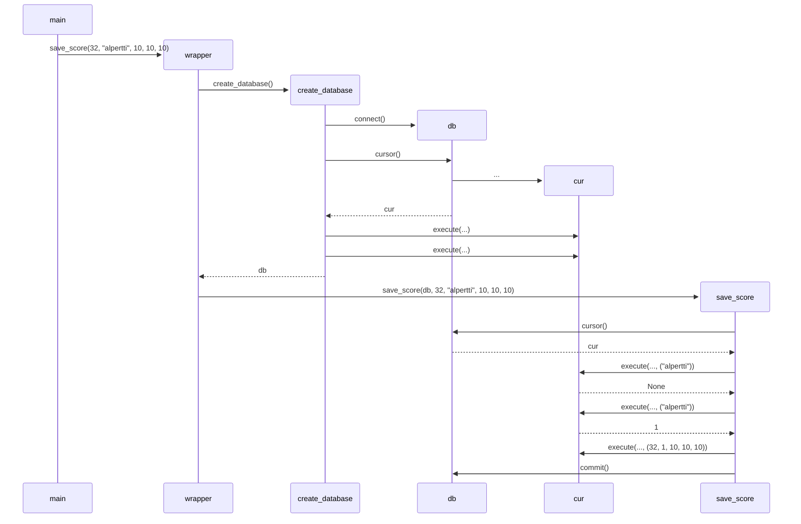

Tässä ompi funktion `save_score` sekvenssikaavio,
kun tietokantaa ei ole entuudestaan olemassa.

```mermaid
sequenceDiagram
  participant main
  create participant wrapper
  main ->> wrapper: save_score(32, "alpertti", 10, 10, 10)
  create participant create_database
  wrapper ->> create_database: create_database()
  create participant db
  create_database ->> db: connect()
  create_database ->> db: cursor()
  create participant cur
  db ->> cur: ...
  db -->> create_database: cur
  create_database ->> cur: execute(...)
  create_database ->> cur: execute(...)
  create_database -->> wrapper: db
  create participant save_score
  wrapper ->> save_score: save_score(db, 32, "alpertti", 10, 10, 10)
  save_score ->> db: cursor()
  db -->> save_score: cur
  save_score ->> cur: execute(..., ("alpertti"))
  cur -->> save_score: None
  save_score ->> cur: execute(..., ("alpertti"))
  cur -->> save_score: 1
  save_score ->> cur: execute(..., (32, 1, 10, 10, 10))
  save_score ->> db: commit()
```
